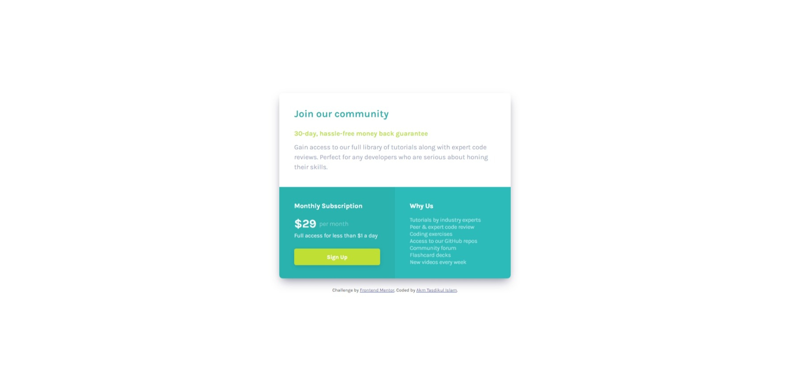

# Frontend Mentor - Single price grid component solution

This is a solution to the [Single price grid component challenge on Frontend Mentor](https://www.frontendmentor.io/challenges/single-price-grid-component-5ce41129d0ff452fec5abbbc). Frontend Mentor challenges help you improve your coding skills by building realistic projects.

## Table of contents

- [Overview](#overview)
  - [The challenge](#the-challenge)
  - [Screenshot](#screenshot)
  - [Links](#links)
- [My process](#my-process)
  - [Built with](#built-with)
  - [What I learned](#what-i-learned)
  - [Useful resources](#useful-resources)
- [Author](#author)

## Overview

Project Started: 20 January 2024
Project Duration: 03 hours

### The challenge

Users should be able to:

- View the optimal layout for the component depending on their device's screen size
- See a hover state on desktop for the Sign Up call-to-action

### Screenshot




### Links

- [Solution URL here](https://github.com/akmtasdikulislam/single-price-grid-component)
- [Live site URL here](https://akmtasdikulislam.github.io/single-price-grid-component/)

## My process

- At first I linked CSS file and other GOOGLE FONTS with `index.html`
- Then added the _css color variables_ following the provided style guides in the _style-guide.md_ file.
- Then initalized the css file.
- After then, I wrote necessary html and css code to match the _desktop-version: UI Design Sample_
- After completing desktop-version UI Design development. I wrote necessary html and css codes to match _mobile-version: UI Design Sample_

### Built with

- Semantic HTML5 markup
- CSS custom properties
- Flexbox
- CSS Grid

### What I learned

By doing this project I learned, how to use CSS Grid.

```css
.grid-container {
  display: grid;
  grid-template-columns: repeat(12, 1fr);
  // It will create 12 fraction of the available width of the *grid-container*
  grid-template-rows: repeat(2, 1fr);
  // It will create 02 fraction of the available height of the *grid-container*
}
```

### Useful resources

- [93 CSS Box Shadow](https://getcssscan.com/css-box-shadow-examples) - This helped me for adding box shadow to the card-container to match the UI Design Sample.

## Author

- Frontend Mentor - [@akmtasdikulislam](https://www.frontendmentor.io/profile/akmtasdikulislam)
- Twitter - [@Akm_Tasdikul](https://www.twitter.com/yourusername)
